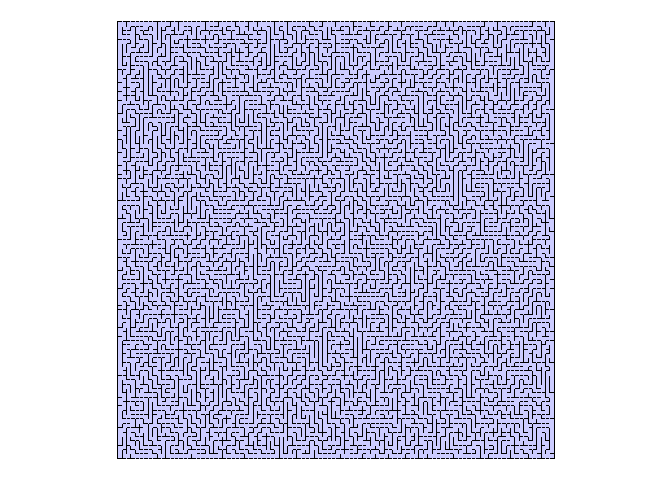

Maze generation
================

Generate a maze from a grid using a depth-first search. From a cell, we
visit a random neighbour cell that not yet visited, mark it as visited.
We remove the wall between the two cells and add the new cell to the
stack. This process continues until all cells have been visisted.

## Demostration

``` r
# load the class
source("MazeGenerator.R")
```

### Small Maze (10 by 10 grid)

``` r
maxeGenerator = MazeGenerator$new(height = 10, width = 10)
maxeGenerator$draw()# draw grid 
maxeGenerator$createMaze() # create maze
maxeGenerator$draw() # draw grid after creation
```


### Large Maze (100 by 100 grid)

``` r
maxeGenerator = MazeGenerator$new(height = 100, width = 100)
maxeGenerator$draw()# draw grid 
maxeGenerator$createMaze() # create maze
maxeGenerator$draw() # draw grid after creation
```


